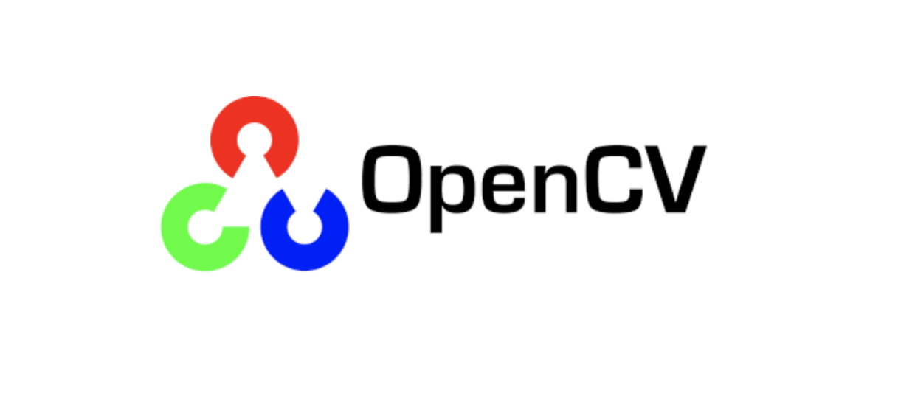

   

 

  

  

    
      
     
      
      
        
  

<strong>
   
  See <a href="https://netbird.io/docs/">Documentation</a>
   
   Join our <a href="https://join.slack.com/t/netbirdio/shared_invite/zt-2utg2ncdz-W7LEB6toRBLE1Jca37dYpg">Slack channel</a>
   
 
</strong>

